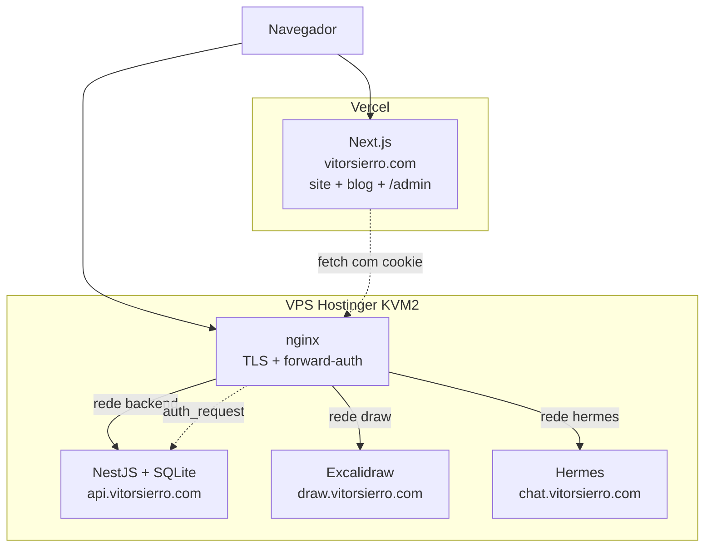
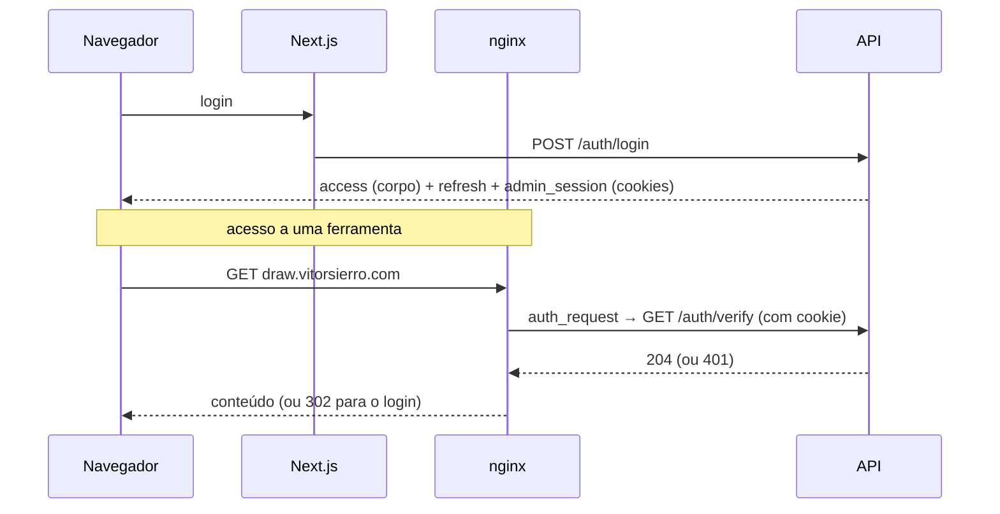

# Design — Portfólio, Blog/CMS e ferramentas self-hosted

Documento de arquitetura. Descreve **o que** foi construído e, sobretudo, **por
que** cada decisão foi tomada — incluindo as alternativas descartadas.

Para armadilhas do dia a dia, ver [CLAUDE.md](CLAUDE.md).
Para operar e implantar, ver [infra/README.md](infra/README.md).

---

## 1. Objetivo

Três necessidades que acabaram convergindo para um sistema só:

1. Um **portfólio** público (já existia).
2. Um **blog com CMS** próprio, para publicar sem depender de plataforma de
   terceiros.
3. Duas **ferramentas self-hosted** — Excalidraw e Hermes — acessíveis pela
   internet, mas **só por mim**.

O requisito que amarra tudo: **um único login** deve valer para o CMS e para as
duas ferramentas, sendo que nenhuma delas tem autenticação própria.

---

## 2. Topologia



O front fica na Vercel (CDN, build automático); o resto na VPS, que amortiza
custo entre vários serviços e — crucialmente — oferece **disco persistente**,
o que mantém o SQLite viável.

**Segmentação de rede:** uma rede Docker por zona, com o nginx sendo a única
peça presente em todas. Só o nginx publica portas.

---

## 3. Componentes

| Componente | Stack | Responsabilidade |
|---|---|---|
| `apps/web` | Next.js 15 (App Router), React 19, CSS Modules | Site, blog público, CMS |
| `apps/api` | NestJS 11, Prisma, SQLite | Auth, posts, forward-auth |
| `infra/` | Docker Compose, nginx, certbot | Orquestração, TLS, gate |

Sem Tailwind: o portfólio já usava CSS Modules e não havia razão para
introduzir um segundo sistema de estilo.

### Rotas do site

| Rota | Acesso | Descrição |
|---|---|---|
| `/` | público | Portfólio |
| `/blog` | público | Lista com infinite scroll |
| `/blog/post/[slug]` | público | Post renderizado |
| `/admin/login` | público | Login |
| `/admin` | sessão | Hub: Posts, Excalidraw, Hermes |
| `/admin/posts` | sessão | Gerenciador: busca + paginação |
| `/admin/posts/[id]` | sessão | Editor (`new` cria) |
| `/admin/draw` | sessão | Excalidraw embutido |

### Endpoints da API

| Método | Rota | Proteção |
|---|---|---|
| `POST` | `/auth/login` | — (rate limit no nginx) |
| `POST` | `/auth/refresh` | cookie + `OriginCheckGuard` |
| `POST` | `/auth/logout` | cookie + `OriginCheckGuard` |
| `GET` | `/auth/verify` | cookie de sessão — usado pelo nginx |
| `GET` | `/posts` | público (só publicados, cursor) |
| `GET` | `/posts/:slug` | público (só publicados) |
| `POST/PATCH/DELETE` | `/posts[/:id]` | `JwtAuthGuard` (Bearer) |
| `GET` | `/admin/posts[/:id]` | `JwtAuthGuard` (Bearer) |

---

## 4. Modelo de dados

```prisma
model Admin {
  id           String    @id @default(cuid())
  email        String    @unique
  passwordHash String                        // bcrypt, custo 12
  sessions     Session[]
}

model Session {                              // uma linha por navegador
  id               String   @id @default(cuid())
  adminId          String
  tokenHash        String   @unique          // sha256 do cookie das ferramentas
  refreshTokenHash String?                   // sha256 do refresh do CMS
  expiresAt        DateTime                  // deslizante, 7d
  createdAt        DateTime                  // teto absoluto, 30d
  lastSeenAt       DateTime
}

model Post {
  id            String    @id @default(cuid())
  title         String
  slug          String    @unique
  body          String                       // markdown cru, editável
  coverImageUrl String?
  tags          String    @default("")       // CSV — SQLite não tem array
  published     Boolean   @default(false)
  publishedAt   DateTime?
}
```

O markdown é armazenado **cru** e convertido a cada leitura. Guardar HTML
renderizado tornaria o post não editável e congelaria decisões do renderizador.

---

## 5. Autenticação

O ponto central do design. Existem **duas credenciais**, com propósitos
distintos, emitidas juntas no login e guardadas na mesma linha de `Session`.

| | Access token | Refresh token | Cookie de sessão |
|---|---|---|---|
| Formato | JWT (15min) | JWT (7d) | token opaco, 32 bytes |
| Onde vive | memória do JS | cookie httpOnly | cookie httpOnly |
| Escopo | — | host-only `api.`, `Path=/auth` | `.vitorsierro.com`, `Path=/` |
| Serve para | mutações do CMS | renovar o access | liberar as ferramentas |

### Fluxo



### Por que o cookie de sessão é opaco, e não JWT

Revogação. O logout precisa encerrar o acesso **imediatamente**, e um JWT só
expira. Como a verificação já teria de consultar o banco para checar revogação,
o JWT não pouparia a ida ao banco — apenas somaria superfície de forja.

### Por que o refresh vive na linha de `Session`

Primeira versão guardava um único `refreshTokenHash` na tabela `Admin`. Isso
significava **um hash global**: cada novo login ou refresh sobrescrevia o
anterior, derrubando silenciosamente as outras abas e dispositivos. O sintoma
foi "pede login toda vez que troco de aba".

Hoje o `sid` viaja no JWT de refresh, então a rotação toca apenas a linha do
navegador que pediu.

### Por que `SameSite=Lax` basta

`SameSite` é avaliado por **domínio registrável** (eTLD+1), não por origem.
`vitorsierro.com` ↔ `api.vitorsierro.com` é *same-site*, então o cookie
circula entre Vercel e VPS sem precisar de `SameSite=None`. Foi isso que
tornou o login único viável sem cookies de terceiros.

Consequência aceita: previews da Vercel em `*.vercel.app` são cross-site e
não autenticam.

---

## 6. Invariantes de segurança

Quebrar qualquer um destes reabre um buraco real.

1. **`JwtAuthGuard` lê somente o header `Authorization`.** É isso que torna as
   mutações do CMS estruturalmente imunes a CSRF. Um fallback por cookie seria
   a única mudança capaz de tornar *toda* mutação forjável — e o cookie de
   sessão é same-site a partir dos subdomínios das ferramentas.
2. **`draw.` / `chat.` nunca entram no `WEB_ORIGIN`** (allowlist de CORS e do
   `OriginCheckGuard`).
3. **O cookie de refresh é host-only.** Dar-lhe `Domain=.vitorsierro.com`
   mandaria a credencial de maior valor às ferramentas a cada request.
4. **`GET /auth/verify` responde 204 ou 401, nunca 3xx.** O `auth_request` do
   nginx trata qualquer outra coisa como erro; o redirect é do proxy.
5. **`?next=` é validado por parse de `URL` + allowlist de hostname.**
   Comparação por prefixo é furada por `//evil.com` e
   `https://vitorsierro.com@evil.com` — há teste para ambos.
6. **O subrequest de auth não carrega `Origin`.** O nginx copia os headers do
   request original, e o navegador envia `Origin` em subrecursos cross-origin;
   sem limpar, o CORS rejeitava e o gate devolvia 500.

---

## 7. Modelo de ameaças

O Hermes é o componente mais sensível: executa comandos e processa entrada
não confiável (mensagens, páginas). O design assume que **ele pode ser
comprometido** e limita o estrago:

- Sem acesso ao socket do Docker → não controla outros containers.
- Sem o volume `api_data` → não alcança o arquivo do banco.
- Sem `privileged` e sem capabilities extras → não escala para root.
- Rede isolada → não fala com `api:3001` nem com o Excalidraw.

Esse último é o que mais importa: numa rede compartilhada, ele contornaria o
rate limit do `/auth/login`, que vive no nginx — uma chamada interna pula o
proxy. Pela via pública ele até alcança a API, mas aí sujeito ao limite.

**Superfícies fechadas por verificação ativa:** injeção SQL (Prisma
parametriza), XSS armazenado (`sanitize-html` sobre a saída do `marked`),
forja de JWT (`alg:none` e segredo adivinhado), replay de refresh rotacionado.

---

## 8. Decisões e alternativas descartadas

| Decisão | Alternativa descartada | Motivo |
|---|---|---|
| SQLite | Postgres | Volume de um blog pessoal não justifica; a VPS dá disco real. Prisma permite migrar depois com pouco atrito. |
| VPS | Render/Vercel para a API | Serverless tem FS efêmero (mataria o SQLite) e a VPS amortiza custo entre 3 serviços. |
| Forward-auth no proxy | Subrotas em `/admin/*` | Apps self-hosted quebram assets fora da raiz, e `/admin` já pertence ao Next. A barreira vem do proxy, não da URL. |
| Markdown renderizado no servidor | Renderizar no cliente | Zero dependências novas no front e sanitização num lugar só. |
| Paginação por cursor (público) | Offset | Estável sob inserção — offset duplica ou pula itens quando um post novo entra. |
| Paginação por offset (admin) | Cursor | Aqui "página 3" é requisito de UI; o custo de offset é irrelevante nessa escala. |
| Excalidraw em iframe | Também embutir o Hermes | O comportamento do dashboard quanto a `X-Frame-Options`/`frame-ancestors` não foi verificado, e afrouxar embed no proxy é o tipo de coisa que não se faz às cegas numa ferramenta que executa comandos. Ele abre em aba própria. |
| Basic auth do dashboard do Hermes | Confiar só no forward-auth do nginx | O dashboard se recusa a escutar fora do loopback sem provedor de auth próprio — não existe modo "bind público sem autenticação". Custa um segundo prompt de senha além do `/admin`, mas não é opcional: sem ele o dashboard nunca abre a porta. |

---

## 9. Operação

- **Deploy:** `./infra/deploy.sh` — backup, `git pull`, rebuild, restart. As
  migrations rodam no start do container da API.
- **Backup:** cron diário com `sqlite3 .backup` (não `cp`, que pode capturar
  arquivo em escrita). ⚠️ Ainda grava no mesmo disco — cópia off-site pendente.
- **TLS:** certbot; **os certificados precisam existir antes do primeiro
  `up`**, senão o nginx não sobe.
- **Verificação:** `infra/verify-auth.sh` roda 13 asserções do contrato de
  auth. Serve tanto local quanto contra a VPS depois do deploy.

Testes: 32 na API, 16 no web.

---

## 10. Limitações conhecidas

| Limitação | Impacto | Encaminhamento |
|---|---|---|
| Backup no mesmo disco | Perda total se o disco falhar | Plugar rclone/S3 no ponto marcado |
| SQLite = escritor único | Contenção sob carga alta | Suficiente na escala atual; Postgres se mudar |
| WebSocket só autentica no handshake | Socket aberto sobrevive ao logout | `proxy_read_timeout` de 1h limita |
| Login duplo no Hermes | Basic auth do dashboard + sessão do `/admin` — dois prompts de senha | Investigar `HERMES_DASHBOARD_OIDC_*` com issuer próprio, se o atrito incomodar |
| Previews da Vercel não autenticam | Não dá para testar `/admin` em preview | Alias `*.preview.vitorsierro.com` |
| Colaboração do Excalidraw inativa | Só desenho individual | Exige buildar o front com `VITE_APP_WS_SERVER_URL` |
